# 新媒体运营工作台 · 使用说明（图文版）

## 1. 产品概述

**新媒体运营工作台**是一款面向新媒体运营场景的 PWA（Progressive Web App），把日常运营工作整合到同一个页面：

- 多账号面板：一览所有账号的待办、选题、健康分、发布状态；
- 备忘录 / 待办 / 提醒：记录灵感、管理任务、设置到点通知；
- 日历视图：按日期查看所有待发布/待办/提醒；
- 选题素材库：管理灵感、草稿、待发、已发内容；
- 数据看板：录入并查看多账号粉丝/阅读/点赞/评论趋势；
- 周/月报：自动聚合本周/本月工作产出，一键复制或下载 Markdown。

数据默认保存在浏览器 `localStorage` 中，可离线使用；也支持通过设置里的「云端同步」接入后端实现多设备共享。

---

## 2. 界面总览

打开应用后，桌面端呈现左中右三栏布局：左侧导航与账号切换、顶部工具栏、右侧主内容区。

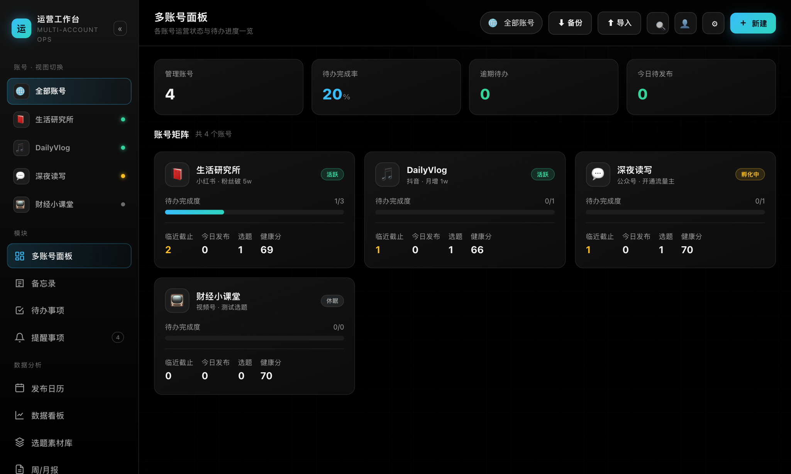

- **A. 左侧边栏**：品牌区、账号切换面板、功能模块入口、底部同步状态胶囊。
- **B. 顶部工具栏**：当前页面标题、账号范围选择、备份/导入/搜索/设置/新建按钮。
- **C. 主内容区**：根据当前模块展示对应数据卡片或列表。

> 在手机端，左侧边栏会隐藏，取而代之的是底部 8 个模块图标，操作逻辑与桌面端一致。

---

## 3. 各模块界面说明

### 3.1 多账号面板

默认首页，展示全部账号的运营卡片：待办完成度、今日发布、选题数、健康分。

- 点击账号名称可切换到该账号的单独视图；
- 点击卡片内的「今日发布 / 选题」可快速跳转对应模块。

### 3.2 备忘录

用于记录碎片化灵感、会议记录、素材片段，支持标签与置顶。

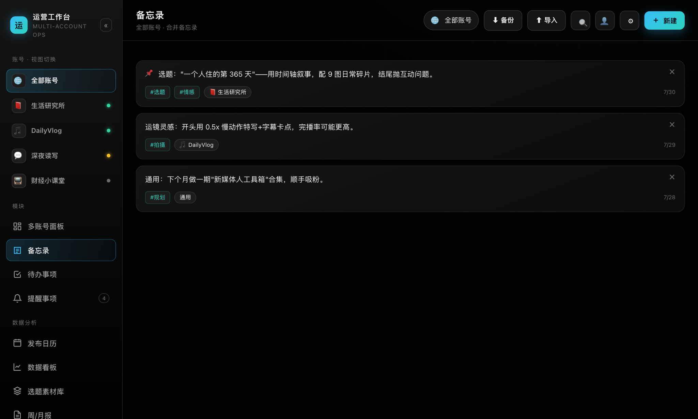

- 卡片按时间倒序排列；
- 搜索框可按正文 / 标签检索；
- 点击卡片进入编辑，支持删除。

### 3.3 待办事项

管理日常任务，支持优先级、截止日期、归属账号。

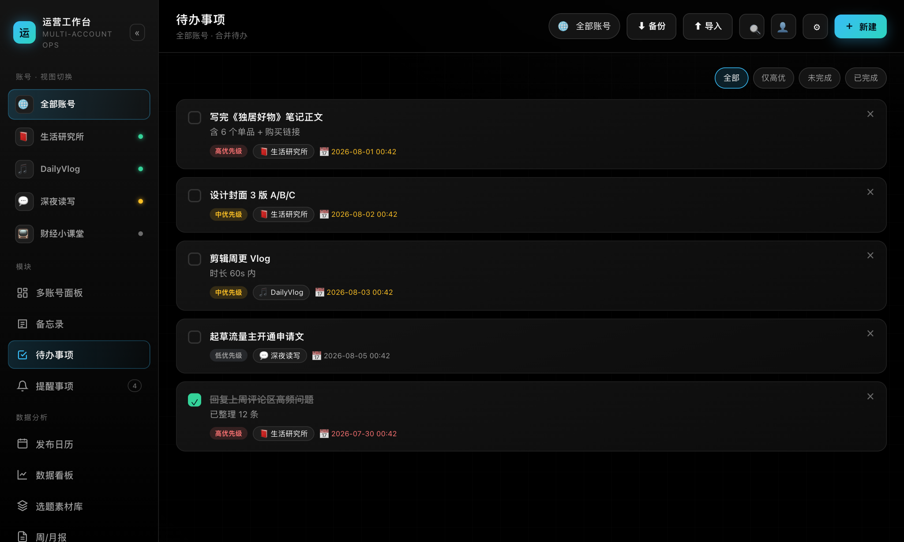

- 左侧复选框可快速标记完成；
- 逾期日期会显示为红色；
- 顶部 chips 可按状态筛选。

### 3.4 提醒事项

设置一次性或周期性提醒，到点弹出系统通知。

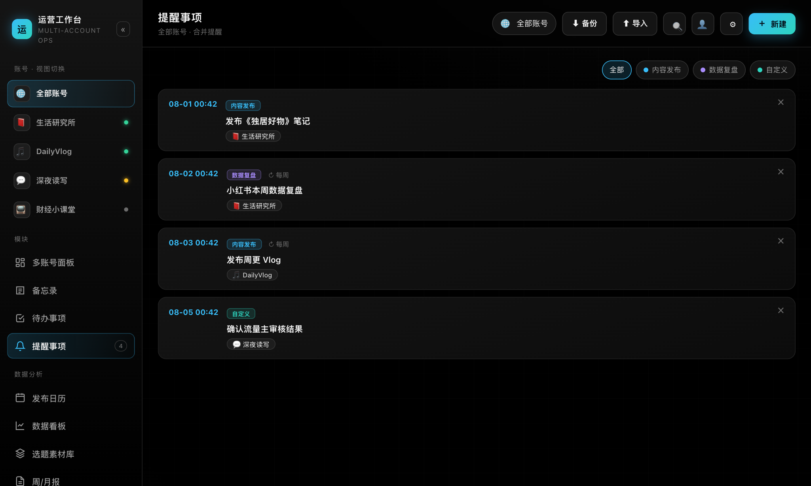

- 类型颜色可自定义；
- 支持「每天 / 每周 / 每月」重复；
- 需要浏览器通知权限（首次可在设置中申请）。

### 3.5 日历

按月展示所有带日期的事项：待办、提醒、选题发布。

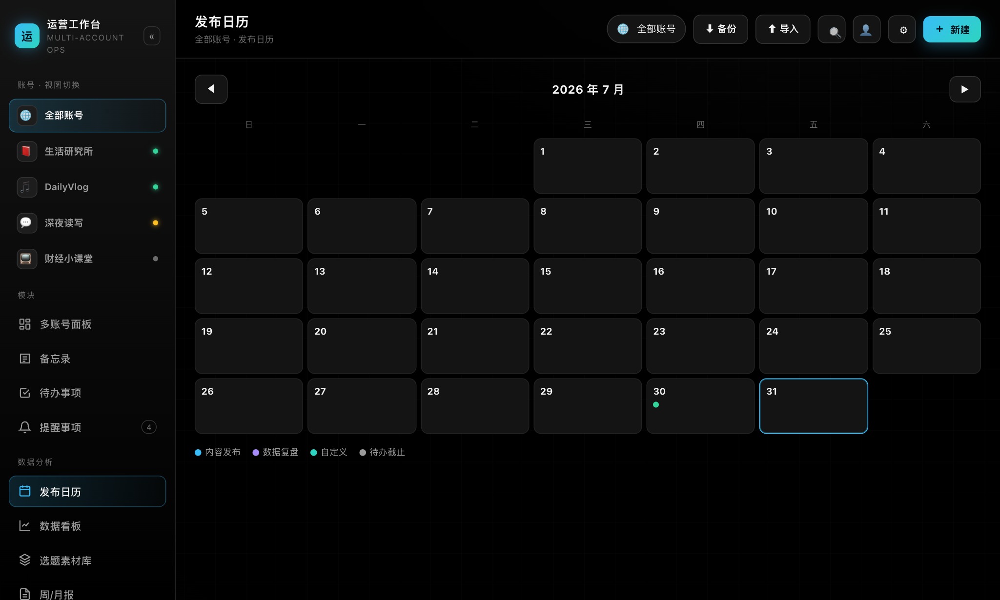

- 点击日期进入单日详情；
- 日期上的小色块代表不同类型的事件；
- 可直接在日历上选择日期新建提醒。

### 3.6 选题素材库

管理内容选题全生命周期：灵感 → 草稿 → 待发 → 已发。

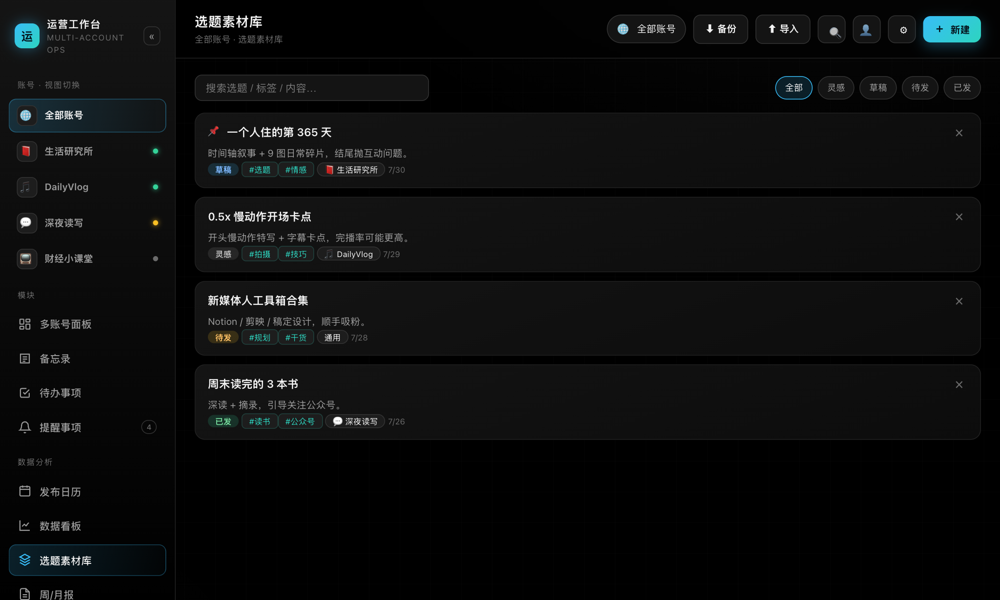

- 状态用颜色区分（灰 / 蓝 / 琥珀 / 绿）；
- 支持标签、置顶、搜索；
- 点击卡片编辑正文与标签。

### 3.7 数据看板

手动录入每日数据，查看趋势与账号对比。

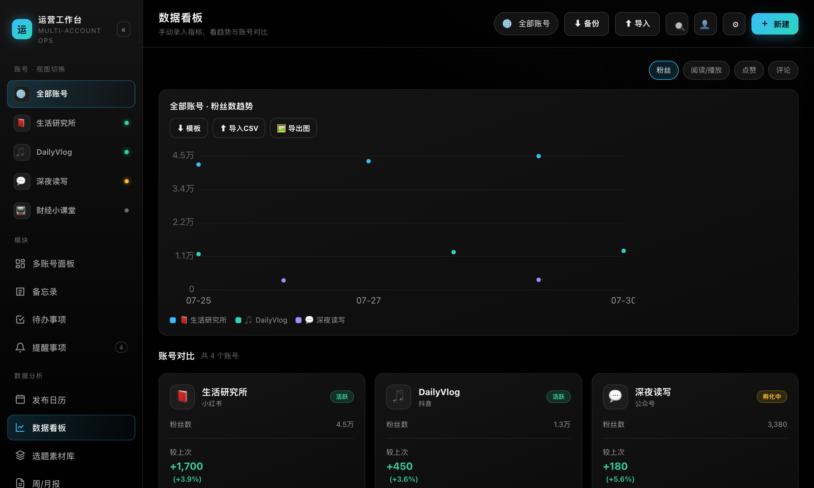

- 切换指标 chips：粉丝 / 阅读播放 / 点赞 / 评论；
- SVG 多线趋势图展示最近录入；
- 对比卡显示最新值与上次变化（涨红跌绿）。

### 3.8 周/月报

自动聚合本周或本月工作产出。

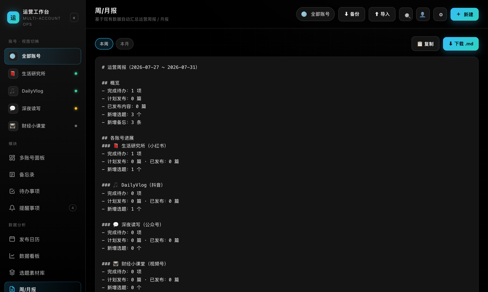

- 切换「本周 / 本月」范围；
- 一键复制 Markdown 文本；
- 可下载 `.md` 文件交付给团队或上级。

---

## 4. 核心操作步骤

### 4.1 切换功能模块

点击左侧边栏的菜单项即可切换主内容区。手机端则点击底部导航。

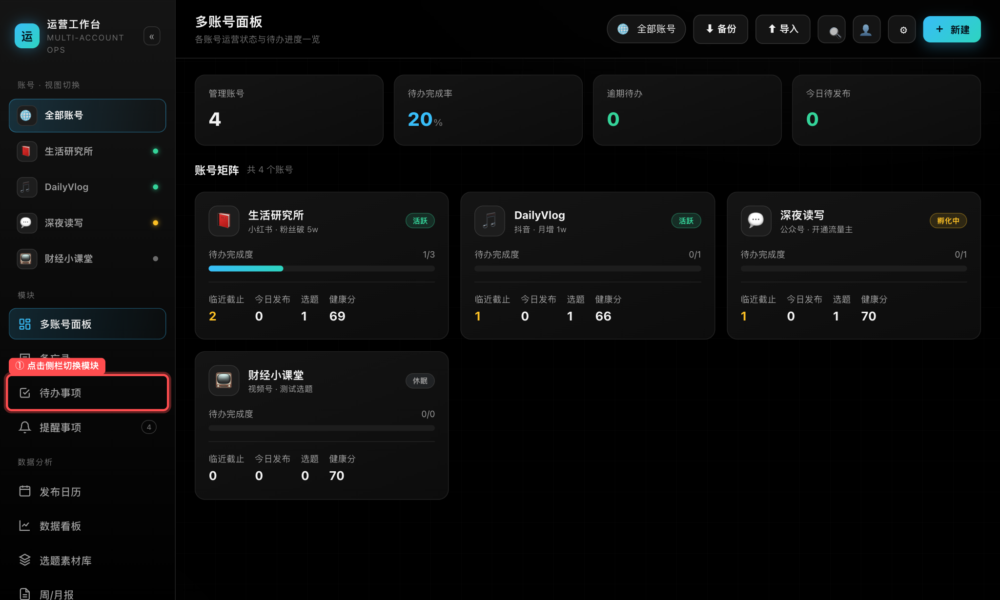

> 当前激活的模块会有高亮底色。

### 4.2 新建一条待办

1. 进入「待办事项」模块；
2. 点击右上角 **「+ 新建」** 按钮；
3. 填写标题、详情、优先级、归属账号和截止日期；
4. 点击「保存」。

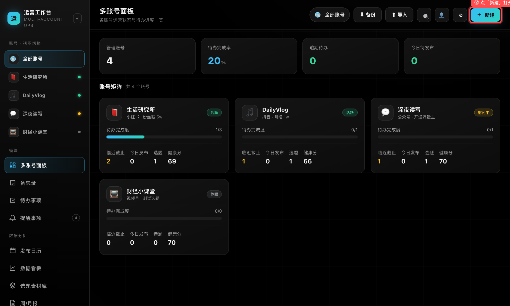

新建弹窗中的日期/时间输入框已针对 iOS Safari 优化，宽度与同级栏保持一致。

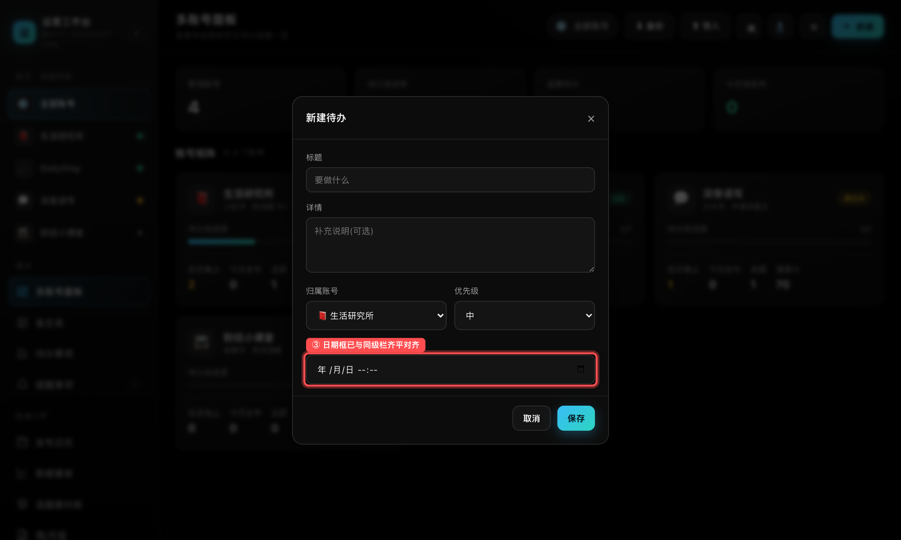

### 4.3 账号范围筛选

在任意模块顶部工具栏点击 **「全部账号」** 胶囊，可切换为单个账号视图。筛选后各模块只显示该账号的数据。

### 4.4 编辑与删除

- 点击任意卡片即可打开编辑弹窗；
- 弹窗底部有「取消」和「保存」按钮；
- 编辑已有项时，底部会出现「🗑 删除」按钮。

### 4.5 全局搜索

点击顶部工具栏的 **🔍** 按钮，输入关键词即可跨模块搜索。

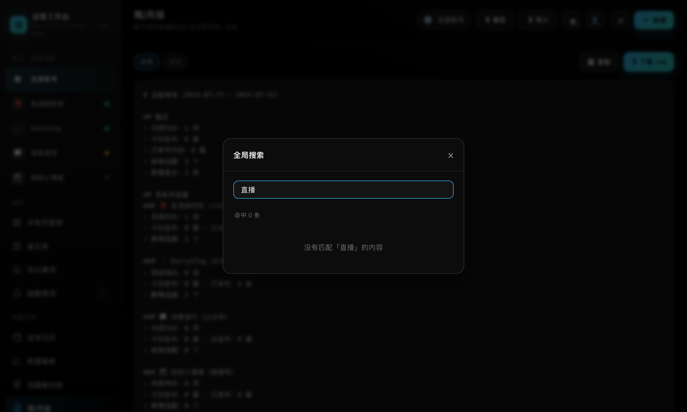

- 覆盖备忘录、待办、提醒、选题、账号；
- 点击搜索结果会跳转到对应模块并打开编辑。

### 4.6 备份与导入

点击顶部工具栏的 **⬇ 备份** / **⬆ 导入**，即可导出全部数据为 JSON，或从 JSON 恢复。

### 4.7 设置中心

点击顶部工具栏的 **⚙** 按钮打开设置。

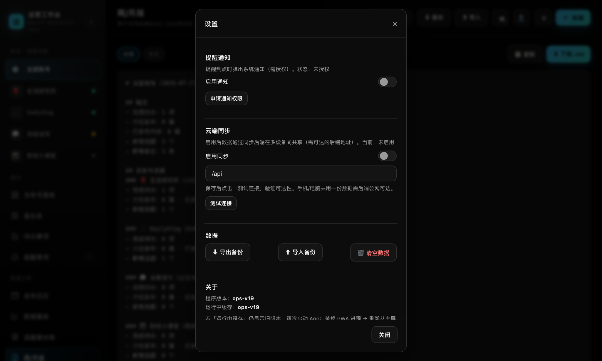

可配置：
- 提醒通知权限；
- 云端同步开关与后端地址；
- 数据备份、导入、清空；
- **关于**：查看当前程序版本与运行中 Service Worker 缓存版本。

### 4.8 个人资料

点击顶部工具栏的 **👤** 按钮（桌面端也可点击左上角品牌区），可修改昵称和头像。

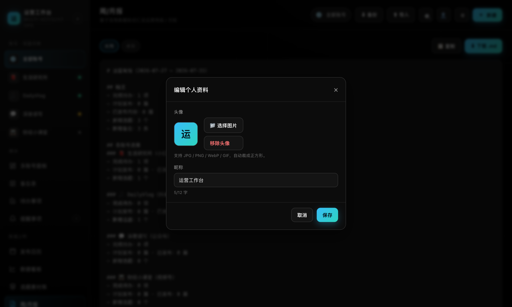

- 昵称会显示在左上角品牌区；
- 头像支持图片 URL 或留空显示首字。

---

## 5. 常见问题解答

### Q1：手机和电脑的数据为什么不互通？

默认数据保存在各自浏览器的 `localStorage` 中。如需多设备共享，需要在「设置 → 云端同步」中启用并填写一个可达的同步后端地址，或手动通过「备份 / 导入」JSON 迁移数据。

### Q2：我更新了 App，但手机端还是旧版怎么办？

PWA 由 Service Worker 缓存外壳资源。如果「设置 → 关于」里的「运行中缓存」仍是旧版本号，请：

1. 从后台彻底划掉 App；
2. 重新从主屏图标打开；
3. 必要时长按主屏图标「删除」后，重新从 Safari「添加到主屏幕」。

### Q3：为什么离线后打不开？

首次在线访问后，Service Worker 会把 App 外壳缓存到本地。之后离线应能打开。如果离线无法打开，请确认你之前至少在线打开过一次，且浏览器没有清除站点数据。

### Q4：提醒到点不弹通知？

需要在系统/浏览器中授予通知权限。可在「设置」中点击「申请通知权限」。iOS PWA 的通知行为受系统控制，建议保持 App 在后台。

### Q5：日期输入框在手机上显示异常？

当前稳定版已针对 iOS Safari 优化。请确保「设置 → 关于」里的「运行中缓存」为最新版本号（如 `ops-v19`），并按 Q2 的方法冷启动 App。

---

## 6. 快速索引

| 想做什么 | 操作路径 |
|----------|----------|
| 查看所有账号状态 | 多账号面板（默认首页） |
| 写备忘录 / 素材 | 备忘录 → 新建 |
| 添加任务并设截止日 | 待办事项 → 新建 → 填截止日期 |
| 设置到点提醒 | 提醒事项 → 新建 → 触发时间 |
| 按月查看发布计划 | 日历 |
| 管理选题状态 | 选题素材库 |
| 录入/查看数据趋势 | 数据看板 |
| 生成本周/本月报告 | 周/月报 |
| 换头像/昵称 | 个人资料 |
| 开启多设备同步 | 设置 → 云端同步 |
